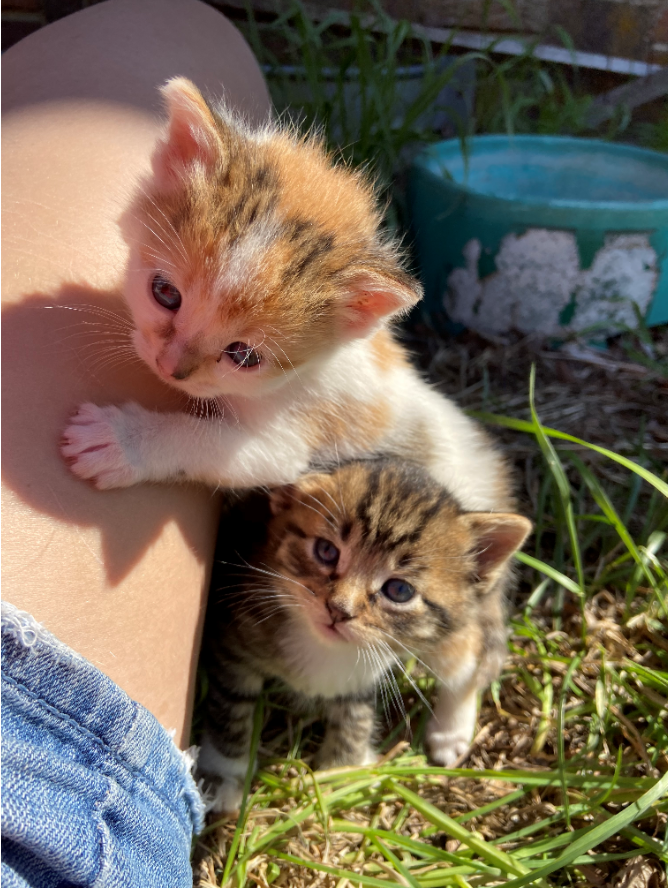

```{r setup, include=FALSE}
knitr::opts_chunk$set(echo = FALSE)
```

## Introduction

-Birthday:October 17th, 1996\
-Where I Grew Up: Johnson, NE\
-Program I'm In:Mechanized Systems Management with a focus in Precision Agriculture\
-Expected Graduation Date: May 2021

## Favorite Animal


```{r, echo=FALSE, fig.cap="My Kittens", out.width = '50%'}


```

## Favorite Plot
```{r, warning=FALSE, message=FALSE, comment=FALSE, echo=FALSE, cache=FALSE}
library(mclust)

```

```{r banknote, echo = FALSE}
library(ggplot2)
data(banknote)
ggplot(data=banknote)+geom_histogram(aes(x=Bottom, fill=Status),binwidth=0.25)+
  ggtitle("Histogram of Bottom Variable with Banknote Status")

```

## CV

<https://github.com/stat850-unl/10-presentation-steten5/blob/master/Teten_CV.pdf>


